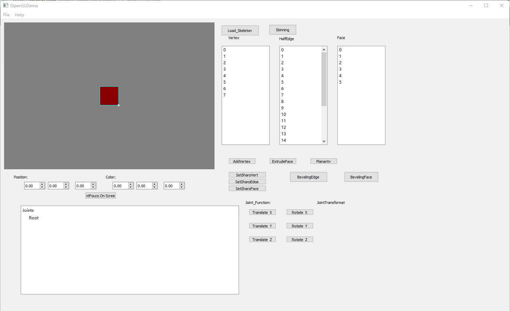
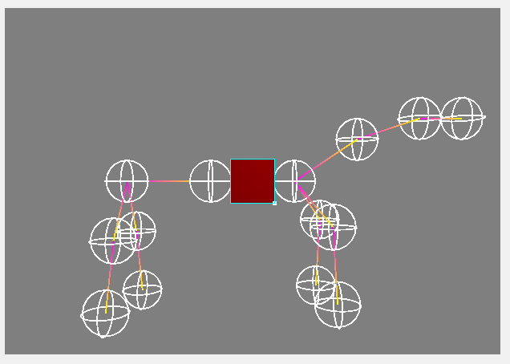
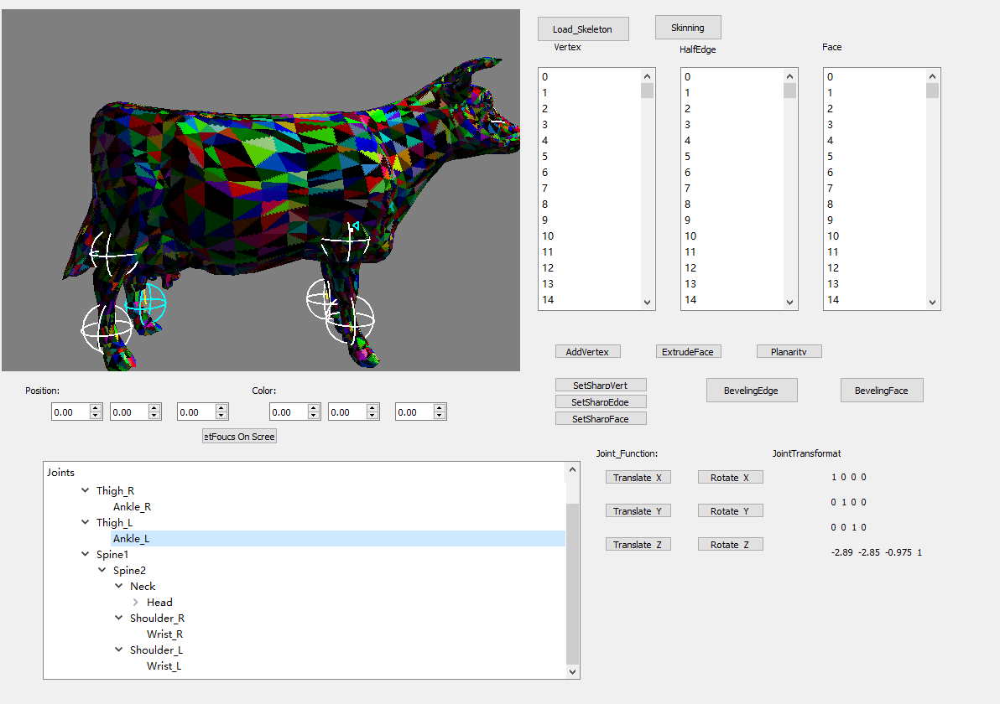

# ComputerGraphics_QT_HW07_Skeleton-and-Skinning
create a basic skeleton joint class and implement functions to bind a half-edge mesh to the skeleton and deform the mesh based on the skeleton.

# Description
* Joint class
* Skeleton file reader 
* Joint influence on vertices
* Skinning function 
* Interactive skeleton
* Shader-based skin deformation

# Screenshots & Results

